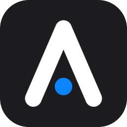
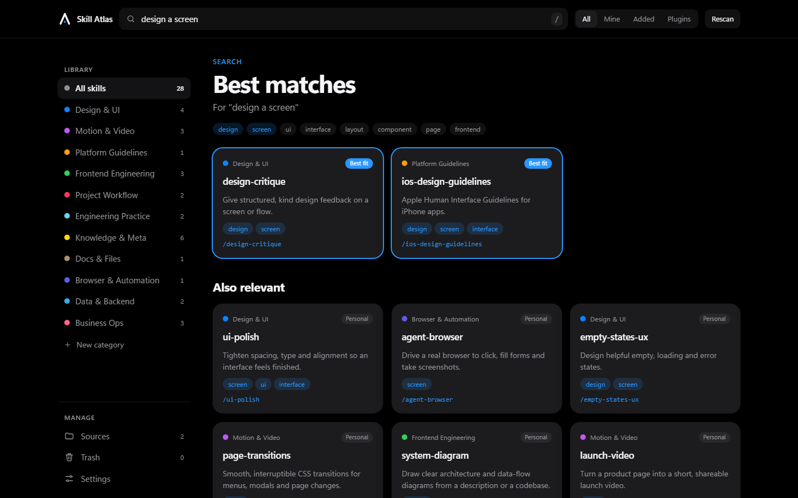
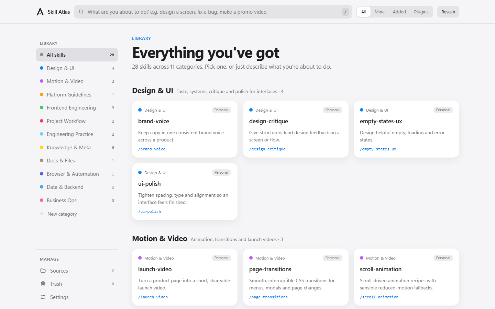
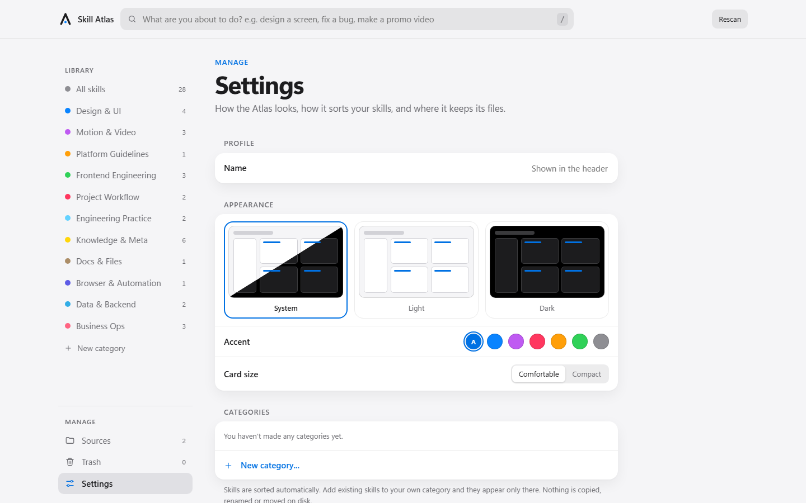

<p align="center">
  
</p>

<h1 align="center">Skill Atlas</h1>

<p align="center"><b>Find the skill you forgot you had.</b></p>

<p align="center">
  <a href="LICENSE"></a>
  
  
  <a href="https://github.com/afnanpvt/skillsatlas/actions/workflows/test.yml"></a>
</p>

<p align="center">
  
</p>

## Why this exists

You write a great Claude Code skill. Two months later you are doing that exact job by hand, because you forgot the skill was ever there.

That is the whole problem, and Skill Atlas is the whole fix. It looks at every skill on your machine, sorts them into clear categories, and lets you search the way you actually think: not "what was that skill called?" but "I'm about to design a screen."

It runs on your computer, reads your own folders, and never phones home.

## What you get

- **Search by the job, not the name.** Type "fix a bug", "make a promo video" or "design an architecture" and the right skills come up first, with the reason they matched. It understands that "screen" and "interface" mean the same thing.
- **Everything sorted for you.** Skills land in categories like Design, Motion and Video, Engineering, Docs, and Business Ops. Don't like where one went? Make your own categories and move skills into them. Nothing on disk changes.
- **Read and edit in place.** Open any skill, see its full text and every file in its folder, change it and save. Your old version is kept every time.
- **Know what is and isn't a skill.** A skill is a folder with a `SKILL.md`. The Atlas tells you when something is missing a description, or looks like a skill but isn't one, and says why.
- **Bring every folder.** Point it at any folder on your machine, such as a project's `.claude/skills`, and those skills join the library.
- **Safe by default.** Removing a skill moves it to Trash and you can undo it. Saving keeps the previous version. The Atlas never deletes your work.
- **Yours to style.** Light, dark or system. Pick an accent colour and a card size. Put your name on it.

<p align="center">
  
  
</p>

## Install

You need Python 3.9 or newer. There is nothing else to install; Skill Atlas has no dependencies.

**The easy way (recommended)** uses [pipx](https://pipx.pypa.io), which keeps it tidy and gives you a `skillsatlas` command anywhere:

```bash
pipx install git+https://github.com/afnanpvt/skillsatlas.git
skillsatlas
```

**With pip:**

```bash
pip install git+https://github.com/afnanpvt/skillsatlas.git
skillsatlas
```

**From source, no install at all:**

```bash
git clone https://github.com/afnanpvt/skillsatlas.git
cd skillsatlas
python -m skillsatlas
```

Your browser opens at <http://localhost:4747>. That is it.

To update, run `pipx upgrade skillsatlas`. To remove it, run `pipx uninstall skillsatlas`. Your settings live in one small file, `~/.claude/skill-atlas.json`, which you can delete if you want a clean slate.

### Command line options

| Command | What it does |
|---|---|
| `skillsatlas` | Start the Atlas and open it in your browser |
| `skillsatlas --port 5000` | Use a different port (default 4747) |
| `skillsatlas --no-browser` | Start without opening a browser tab |
| `skillsatlas --export atlas.html` | Write a read-only copy you can share with your team |
| `skillsatlas --version` | Show the version |

## A quick tour

1. **Search.** Click the search box (or press `/`) and describe what you are about to do.
2. **Browse.** The sidebar lists your categories. Click one to see its skills.
3. **Open a skill.** You get a plain-language summary, when to reach for it, its command (one click to copy), and three tabs: Overview, Source and Files.
4. **Make your own categories.** Press **New category**, then **Add skills** to pick existing skills from a searchable list. A skill lives in exactly one category, so adding it to yours takes it out of its automatic one.
5. **Add folders.** Open **Sources**, paste any folder path and press **Add folder**. You'll see which skills it found and which things it skipped.
6. **Make it yours.** Open **Settings** for theme, accent colour, card size and your name.

## Where skills come from

The Atlas always reads two places, and you can add as many more as you like.

| Source | What it holds | Edit | Remove |
|---|---|---|---|
| `~/.claude/skills` | Your personal skills | yes | yes, to Trash |
| `~/.claude/plugins/cache` | Skills installed by plugins | no, plugin updates would overwrite edits | no, uninstall the plugin instead |
| Folders you add | Anything on your machine | yes | remove the folder from the list; files are never touched |
| `ATLAS_ROOTS` environment variable | Folders set outside the app (`;` separated on Windows, `:` elsewhere) | yes | n/a |

### What counts as a skill

A skill is a folder that contains a file named exactly `SKILL.md`. The Atlas looks up to 8 levels deep, does not look inside a skill for more skills, and skips `node_modules`, `venv`, `dist`, `build`, `__pycache__` and hidden folders (except `.claude`, `.agents`, `.codex`, `.cursor` and `.github`).

| In the Sources view | What it means |
|---|---|
| Listed normally | `SKILL.md` with `name:` and `description:` |
| Warning | Listed, but there is no frontmatter, no `name:` or no `description:`, so Claude can't tell when to use it |
| Not a skill | A file named `skill.md` (wrong case), a loose `.md` with skill-style frontmatter that isn't in a `SKILL.md` folder (often a slash command), or a folder with no `SKILL.md` |

If the same skill is installed more than once, you see one card with an "Also installed as" note.

## Safe and private

- **Local only.** The server listens on `127.0.0.1`, makes no network calls and collects nothing.
- **Nothing is deleted.** Removing a skill moves its folder to `~/.claude/skills-trash/`. Restore it from the Trash page or the Undo toast.
- **Edits are reversible.** Every save keeps the previous version in `~/.claude/skills-history/`. A save is refused if the file changed on disk after you opened it, so you never overwrite newer work by accident.
- **Locked down.** Anything that changes data needs a custom request header and a `localhost` Host header, which blocks cross-site and DNS-rebinding tricks. File access is confined to the skill's own folder.
- **You choose the folders.** Folders you add are scanned and editable, so only add folders you trust.

## Configuration

| Variable | Meaning |
|---|---|
| `ATLAS_HOME` | Use a Claude config folder other than `~/.claude` |
| `ATLAS_PORT` | Default port (same as `--port`) |
| `ATLAS_ROOTS` | Extra skill folders, separated by `;` on Windows or `:` elsewhere |

Your categories, added folders and settings are saved in `~/.claude/skill-atlas.json`. Look and feel (theme, accent, card size, name) is saved in your browser.

You can also link straight to a view: `/?q=design+a+screen`, `/?view=__settings`, `/?theme=dark`.

## Make it fit your skills

- **Categories and their keyword rules:** `DOMAINS` in `skillsatlas/scan.py`.
- **Search synonyms and "if you say X, suggest skill Y" rules:** `GROUPS` and `INTENTS` in `skillsatlas/index.html`.

## Contributing

Issues and pull requests are very welcome. To work on it:

```bash
git clone https://github.com/afnanpvt/skillsatlas.git
cd skillsatlas
python -m skillsatlas --no-browser   # run it
python tests/test_server.py          # run the tests
```

The tests start the real server against a throwaway folder and exercise listing, skill detection, folders, saving, conflicts, removal, restore, categories, the command line and a set of path-traversal attempts. Please add a test with any change to the server.

The code is small on purpose: `skillsatlas/scan.py` finds and sorts skills, `skillsatlas/server.py` is the local server and command line, and `skillsatlas/index.html` is the whole interface in one file.

## License

[MIT](LICENSE). Use it, change it, share it.
